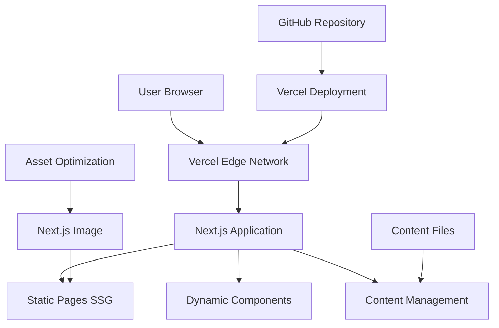
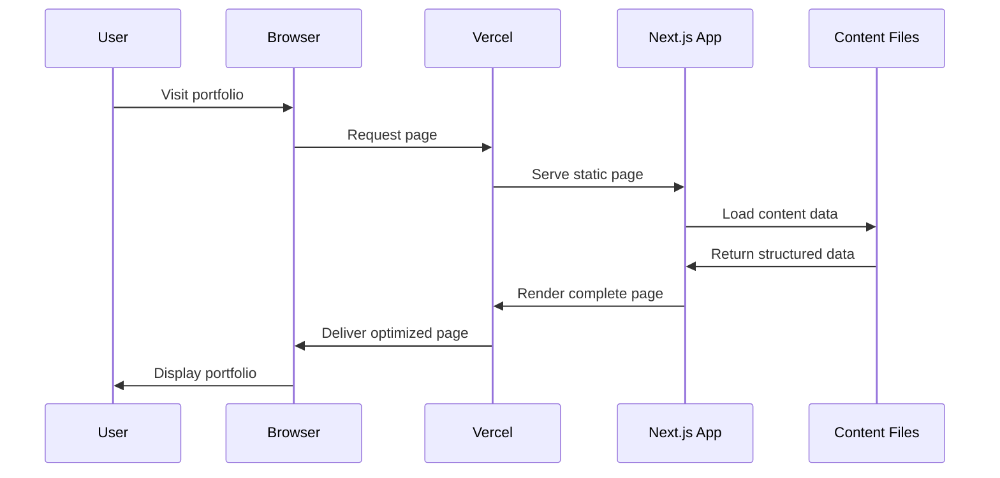

# Design Document: Portfolio Website

## Overview

The portfolio website will be built as a modern, high-performance web application using Next.js 14 with the App Router architecture. The design emphasizes clean aesthetics, optimal performance, and excellent user experience across all devices. The site will leverage static site generation (SSG) for maximum performance while maintaining the flexibility to update content easily.

Key design principles:

- **Performance-first**: Utilizing Next.js SSG, optimized images, and Vercel's edge network
- **Mobile-responsive**: Adaptive design that works seamlessly across all device sizes
- **SEO-optimized**: Comprehensive meta tags, structured data, and semantic HTML
- **Content-focused**: Clean, minimal design that highlights work and achievements
- **Developer-friendly**: TypeScript integration and maintainable code structure

## Architecture

### High-Level Architecture



### Technology Stack

- **Framework**: Next.js 14 with App Router
- **Language**: TypeScript for type safety
- **Styling**: Tailwind CSS for utility-first styling
- **Deployment**: Vercel with automatic deployments
- **Content**: Markdown/MDX for project descriptions
- **Images**: Next.js Image component with optimization
- **Forms**: React Hook Form with validation
- **SEO**: Next.js built-in SEO features + custom meta tags

### Folder Structure

```
portfolio-website/
├── app/
│   ├── (sections)/
│   │   ├── about/
│   │   ├── projects/
│   │   ├── skills/
│   │   └── contact/
│   ├── globals.css
│   ├── layout.tsx
│   └── page.tsx
├── components/
│   ├── ui/
│   ├── sections/
│   └── layout/
├── content/
│   ├── projects/
│   └── data/
├── lib/
├── public/
└── types/
```

## Components and Interfaces

### Core Components

#### 1. Layout Components

**Header Component**

- Responsive navigation menu
- Logo/brand identity
- Mobile hamburger menu
- Smooth scroll navigation
- Active section highlighting

**Footer Component**

- Social media links
- Copyright information
- Quick navigation links
- Contact information

#### 2. Section Components

**Hero Section**

- Professional headshot
- Name and title
- Brief introduction
- Call-to-action buttons
- Animated elements (subtle)

**About Section**

- Professional bio
- Career highlights
- Skills overview
- Resume download link
- Personal photo

**Projects Section**

- Project grid/carousel
- Project cards with previews
- Filter by technology/category
- Modal or dedicated pages for details
- Live demo and source code links

**Skills Section**

- Categorized skill lists
- Visual skill indicators
- Technology logos/icons
- Experience levels

**Contact Section**

- Contact form
- Contact information
- Social media links
- Location (if relevant)
- Response confirmation

#### 3. UI Components

**ProjectCard Component**

```typescript
interface ProjectCardProps {
  title: string;
  description: string;
  technologies: string[];
  imageUrl: string;
  liveUrl?: string;
  githubUrl?: string;
  featured?: boolean;
}
```

**SkillCategory Component**

```typescript
interface SkillCategoryProps {
  category: string;
  skills: Skill[];
}

interface Skill {
  name: string;
  level?: "Beginner" | "Intermediate" | "Advanced" | "Expert";
  yearsOfExperience?: number;
}
```

**ContactForm Component**

```typescript
interface ContactFormData {
  name: string;
  email: string;
  subject: string;
  message: string;
}
```

### Content Management Interfaces

**Project Interface**

```typescript
interface Project {
  id: string;
  title: string;
  description: string;
  longDescription?: string;
  technologies: string[];
  category: string;
  imageUrl: string;
  images?: string[];
  liveUrl?: string;
  githubUrl?: string;
  featured: boolean;
  completedDate: string;
  challenges?: string;
  solutions?: string;
  results?: string;
}
```

**Personal Data Interface**

```typescript
interface PersonalData {
  name: string;
  title: string;
  bio: string;
  email: string;
  phone?: string;
  location?: string;
  socialLinks: SocialLink[];
  resumeUrl?: string;
}

interface SocialLink {
  platform: string;
  url: string;
  icon: string;
}
```

## Data Models

### Content Structure

The website will use a hybrid approach for content management:

1. **Static Configuration**: Personal information, skills, and basic data stored in TypeScript/JSON files
2. **Markdown Content**: Project descriptions and detailed content in MDX format
3. **Asset Management**: Images and documents in the public directory with Next.js optimization

### Data Flow



### SEO Data Structure

```typescript
interface SEOData {
  title: string;
  description: string;
  keywords: string[];
  ogImage: string;
  canonicalUrl: string;
  structuredData: {
    "@type": "Person";
    name: string;
    jobTitle: string;
    url: string;
    sameAs: string[];
  };
}
```

## Error Handling

### Client-Side Error Handling

1. **Form Validation**: Real-time validation with clear error messages
2. **Image Loading**: Fallback images and loading states
3. **Network Errors**: Graceful degradation for contact form submissions
4. **404 Handling**: Custom 404 page with navigation back to main sections

### Server-Side Error Handling

1. **Build-Time Errors**: Content validation during static generation
2. **Runtime Errors**: Error boundaries for component failures
3. **Asset Loading**: Optimized image loading with fallbacks

### Error Recovery Strategies

- **Progressive Enhancement**: Core content accessible even if JavaScript fails
- **Graceful Degradation**: Fallback styles and functionality
- **User Feedback**: Clear error messages and recovery instructions

## Testing Strategy

The testing approach will combine unit testing for individual components and property-based testing for universal behaviors, ensuring both specific functionality and general correctness across all inputs.

### Unit Testing Focus

- Component rendering and props handling
- Form validation logic
- Navigation functionality
- Content loading and display
- SEO meta tag generation
- Responsive design breakpoints

### Property-Based Testing Focus

- Content management system operations
- SEO optimization across all pages
- Image optimization and loading
- Form submission handling
- Navigation consistency
- Performance characteristics

### Testing Tools

- **Jest**: Unit testing framework
- **React Testing Library**: Component testing
- **fast-check**: Property-based testing library for TypeScript
- **Playwright**: End-to-end testing
- **Lighthouse CI**: Performance and SEO testing

### Property Test Configuration

- Minimum 100 iterations per property test
- Each test tagged with: **Feature: portfolio-website, Property {number}: {property_text}**
- Tests will validate universal properties across randomized inputs

## Correctness Properties

_A property is a characteristic or behavior that should hold true across all valid executions of a system—essentially, a formal statement about what the system should do. Properties serve as the bridge between human-readable specifications and machine-verifiable correctness guarantees._

### Property 1: Navigation consistency

_For any_ navigation link in the website, clicking it should result in the corresponding section being displayed or scrolled to correctly
**Validates: Requirements 1.2**

### Property 2: Project interaction completeness

_For any_ project in the gallery, clicking on it should display all required information including description, technologies used, and outcomes, and where links are available, they should be properly rendered
**Validates: Requirements 3.2, 3.3**

### Property 3: Project visual consistency

_For any_ project in the gallery, it should include a preview image and be organized according to its category or technology type
**Validates: Requirements 3.4, 3.5**

### Property 4: Skills organization

_For any_ skill in the system, it should be categorized by type and where proficiency data exists, it should be displayed appropriately
**Validates: Requirements 4.2, 4.3**

### Property 5: Form validation and submission

_For any_ contact form submission, invalid forms should be rejected with appropriate validation messages, and valid forms should be processed successfully with confirmation
**Validates: Requirements 5.3, 5.4**

### Property 6: Responsive layout adaptation

_For any_ screen size within the supported range, the layout should adapt appropriately and maintain usability
**Validates: Requirements 6.1**

### Property 7: Image optimization consistency

_For any_ image in the website, it should use Next.js Image component optimization for fast loading
**Validates: Requirements 6.4, 9.3**

### Property 8: SEO completeness

_For any_ page in the website, it should include appropriate meta tags, structured data markup, optimized titles and descriptions, and proper semantic HTML hierarchy
**Validates: Requirements 7.1, 7.2, 7.4, 7.5**

### Property 9: Content management integration

_For any_ new project added to the content system, it should be automatically displayed in the project gallery with all required information
**Validates: Requirements 8.2**
