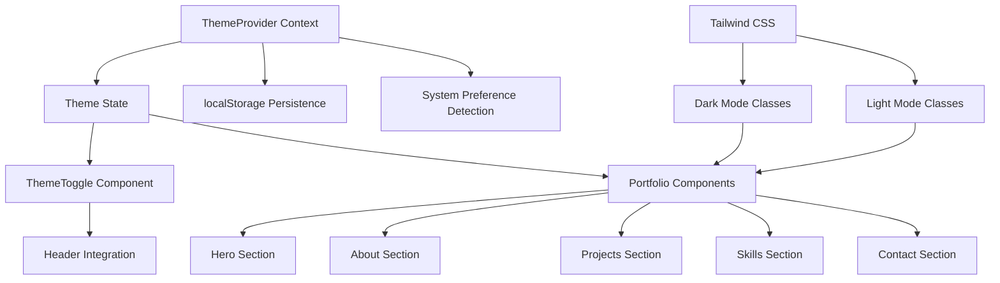

# Design Document: Theme Toggle

## Overview

The theme toggle feature will provide users with the ability to switch between dark and light visual themes for the portfolio website. The implementation leverages the existing Next.js 14 architecture with Tailwind CSS and TypeScript, building upon the current ThemeProvider and ThemeToggle components.

The system consists of three main components:

1. **Theme State Management**: Enhanced ThemeProvider using React Context and localStorage
2. **Theme Toggle UI**: Interactive button component integrated into the header
3. **Theme Application**: Tailwind CSS classes applied consistently across all components

The design prioritizes accessibility, performance, and user experience with smooth transitions and persistent preferences.

## Architecture



The architecture follows a centralized state management pattern where:

- ThemeProvider manages global theme state and persistence
- All components consume theme state through React Context
- Tailwind CSS handles the actual styling through conditional classes
- Theme changes propagate automatically to all consuming components

## Components and Interfaces

### ThemeProvider Enhancement

The existing ThemeProvider will be enhanced to include:

```typescript
interface ThemeContextType {
  theme: "light" | "dark";
  setTheme: (theme: "light" | "dark") => void;
  toggleTheme: () => void;
  systemTheme: "light" | "dark";
  isSystemTheme: boolean;
}

interface ThemeProviderProps {
  children: React.ReactNode;
  defaultTheme?: "light" | "dark" | "system";
  storageKey?: string;
}
```

### ThemeToggle Component

The existing ThemeToggle component will be updated to provide:

```typescript
interface ThemeToggleProps {
  className?: string;
  size?: "sm" | "md" | "lg";
  showLabel?: boolean;
}
```

### Theme Detection Hook

A custom hook for theme-related functionality:

```typescript
interface UseThemeReturn {
  theme: "light" | "dark";
  setTheme: (theme: "light" | "dark") => void;
  toggleTheme: () => void;
  systemTheme: "light" | "dark";
  isSystemTheme: boolean;
  mounted: boolean;
}
```

## Data Models

### Theme State Model

```typescript
type Theme = "light" | "dark";
type ThemePreference = "light" | "dark" | "system";

interface ThemeState {
  current: Theme;
  preference: ThemePreference;
  systemTheme: Theme;
  mounted: boolean;
}
```

### Storage Model

```typescript
interface ThemeStorage {
  key: string;
  get: () => ThemePreference | null;
  set: (theme: ThemePreference) => void;
  remove: () => void;
}
```

### Tailwind Theme Configuration

The design utilizes Tailwind's built-in dark mode support with class-based toggling:

```css
/* Light theme (default) */
.light {
  --background: 255 255 255;
  --foreground: 0 0 0;
  --primary: 59 130 246;
  --secondary: 107 114 128;
}

/* Dark theme */
.dark {
  --background: 17 24 39;
  --foreground: 255 255 255;
  --primary: 96 165 250;
  --secondary: 156 163 175;
}
```

Component styling will use Tailwind's dark: prefix for conditional styling:

```typescript
const componentClasses = {
  background: "bg-white dark:bg-gray-900",
  text: "text-gray-900 dark:text-white",
  border: "border-gray-200 dark:border-gray-700",
  hover: "hover:bg-gray-100 dark:hover:bg-gray-800",
};
```

## Correctness Properties

_A property is a characteristic or behavior that should hold true across all valid executions of a system—essentially, a formal statement about what the system should do. Properties serve as the bridge between human-readable specifications and machine-verifiable correctness guarantees._

### Property 1: Theme Toggle State Consistency

_For any_ initial theme state (light or dark), clicking the theme toggle should result in the opposite theme being active and the appropriate icon being displayed (sun for light, moon for dark).
**Validates: Requirements 1.1, 1.5**

### Property 2: Theme Persistence Round Trip

_For any_ valid theme preference (light, dark, or system), setting the theme should immediately store it in localStorage, and subsequently loading the theme should restore the same preference.
**Validates: Requirements 2.1, 2.2**

### Property 3: System Preference Fallback

_For any_ system color scheme preference, when no manual theme selection exists in storage, the theme system should default to the system preference.
**Validates: Requirements 2.3**

### Property 4: Manual Override Persistence

_For any_ theme system with a stored manual preference, changes to the system preference should not affect the active theme until the stored preference is cleared.
**Validates: Requirements 2.4**

### Property 5: Consistent Theme Application

_For any_ active theme (light or dark), all portfolio sections (Header, Hero, About, Projects, Skills, Contact) should have consistent theme classes applied that match the current theme state.
**Validates: Requirements 3.1, 3.2, 3.3**

### Property 6: Color Contrast Compliance

_For any_ theme (light or dark) and any text element (normal or large), the color contrast ratio between text and background should meet or exceed WCAG 2.1 AA standards (4.5:1 for normal text, 3:1 for large text).
**Validates: Requirements 3.4, 5.5**

### Property 7: FOUC Prevention

_For any_ theme transition, appropriate theme classes should be applied to components before they render to prevent flash of unstyled content.
**Validates: Requirements 4.2**

### Property 8: Transition Property Consistency

_For any_ theme-aware component, CSS transition properties should be applied to all color-related style properties (background, text, border, shadow) for smooth theme changes.
**Validates: Requirements 4.3**

### Property 9: Reduced Motion Respect

_For any_ user with prefers-reduced-motion enabled, theme changes should apply instantly without CSS transitions.
**Validates: Requirements 4.4**

### Property 10: Keyboard Navigation Support

_For any_ keyboard interaction (Tab, Enter, Space), the theme toggle should be focusable and operable, with appropriate focus indicators displayed.
**Validates: Requirements 5.1, 5.3**

### Property 11: ARIA State Accuracy

_For any_ theme state, the theme toggle should have accurate ARIA labels and live region announcements that correctly describe the current theme and available action.
**Validates: Requirements 5.2, 5.4**

### Property 12: ThemeProvider Integration

_For any_ existing ThemeProvider functionality, the enhanced theme system should maintain backward compatibility while adding new theme toggle capabilities.
**Validates: Requirements 6.1**

### Property 13: Tailwind Class Usage

_For any_ theme-aware component, styling should use appropriate Tailwind CSS dark mode classes (dark: prefix) for consistent theme application.
**Validates: Requirements 6.2**

### Property 14: SSR Hydration Consistency

_For any_ server-side rendered page, the initial theme state should match between server and client to prevent hydration mismatches.
**Validates: Requirements 6.3**

## Error Handling

The theme system will handle various error conditions gracefully:

### Storage Errors

- **localStorage unavailable**: Fall back to session-only theme state
- **Storage quota exceeded**: Clear old theme data and retry
- **Invalid stored values**: Reset to system preference

### System Preference Detection Errors

- **matchMedia not supported**: Default to light theme
- **Permission denied**: Use light theme as fallback

### Component Integration Errors

- **Missing ThemeProvider**: Components should render with default light theme
- **Context not available**: Individual components should handle graceful degradation

### Accessibility Errors

- **ARIA attributes missing**: Provide fallback text content
- **Focus management issues**: Ensure keyboard navigation remains functional

## Testing Strategy

The theme toggle feature will be validated through a dual testing approach combining unit tests and property-based tests.

### Unit Testing

Unit tests will focus on:

- Specific theme toggle interactions and state changes
- Edge cases like storage unavailability or invalid preferences
- Integration points between ThemeProvider and consuming components
- Accessibility features like keyboard navigation and ARIA attributes
- Error conditions and graceful degradation scenarios

### Property-Based Testing

Property tests will validate universal correctness properties using a minimum of 100 iterations per test:

- Theme state consistency across all possible initial states
- Storage persistence round-trip behavior with various theme preferences
- Consistent theme application across all portfolio components
- Color contrast compliance for all theme and text combinations
- ARIA state accuracy for all possible theme states

Each property test will be tagged with: **Feature: theme-toggle, Property {number}: {property_text}**

### Testing Configuration

- **Framework**: Jest with React Testing Library for unit tests
- **Property Testing**: fast-check library for property-based tests
- **Accessibility Testing**: jest-axe for automated accessibility validation
- **Visual Regression**: Chromatic or similar for theme consistency validation
- **Coverage Target**: 95% code coverage with focus on critical theme logic paths

The testing strategy ensures comprehensive validation of both specific behaviors and universal properties, providing confidence in the theme system's correctness and reliability.
